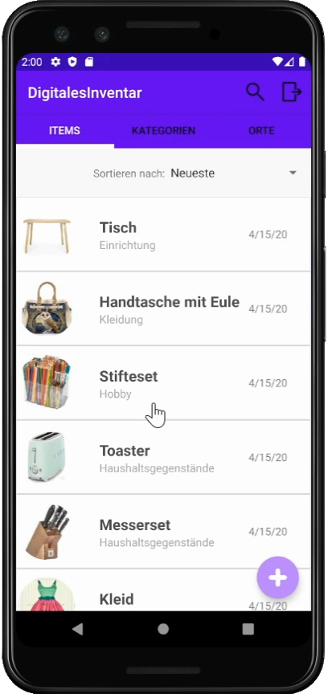

# Digitales Inventar

Das Digitale Inventar ist eine Anwendung, welche die Orgnanisation und Verwaltung eines Haushalts vereinfachen und übersichtlicher gestalten soll. 
Mit Hilfe des Digitalen Inventars soll es möglich sein, jegliche Art Gegenstände zu erfassen, diese zu kategorisieren und besser verwalten zu können. 
Der/Die Nutzer/in kann seine/ihre Gegenstände erfassen, benennen und verschieden annotieren. 
Der/Die Nutzer/in kann verschiedene Kategorien erstellen, benennen und verwalten. 
Änderungen des Bestands können über Löschungen und Editierungen an den Gegenständen und Kategorien nachvollzogen werden. 

[dritte Veröffentlichung](https://github.com/UniRegensburg/ase-abschlussprojekte-ws1920-digitales-inventar/releases/tag/v1) 
[zweite Veröffentlichung](./docs/APK/DigitalesInventarV02.apk) 
[erste Veröffentlichung](./docs/APK/DigitalesInventarV01.apk) 

Technische Informationen zur dieser Anwendung finden sich [hier](./docs/Setup.md), eine detaillierte Übersicht über den Anforderungskontext findet sich [hier](./docs/Overview.md).

## Team

#### Fabian Feldmeier
 
fabian.feldmeier@stud.uni-regensburg.de 
[FabianFeldmeier](https://github.com/FabianFeldmeier) 

#### Lucas Haberl
 
lucas.haberl@stud.uni-regensburg.de 
[HaberlPre](https://github.com/HaberlPre) 

#### Tanja Gehr
 
tanja.gehr@stud.uni-regensburg.de 
[tangeh](https://github.com/tangeh) 

#### Laura Zeilbeck
 
laura.zeilbeck@stud.uni-regensburg.de 
[ladyViolet](https://github.com/ladyViolet) 

## Beschreibung

Das Digitale Inventar erlaubt es dem Nutzer/in Gegenstände zu seinem/ihrem Inventar
hinzuzufügen und diese wieder zu entfernen.
Eine individuelle Anmeldung ist durch eine Email-Adresse notwendig. 
Dem Gegenstand kann ein Name, ein Ort, eine Kategorie, das Kaufdatum und ein Wert in € gegeben werden. 
Das Erstelldatum wird automatisch vom System hinzugefügt. Der/Die Nutzer/in kann seine/ihre Gegenstände nach dem Erstellen bearbeiten und Name, Ort, Kategorie, Kaufdatum und Wert ändern. Der/Die Nutzer/in kann seine/ihre Gegenstände aufgelistet sehen. 
Der/Die Nutzer/in kann seine/ihre Gegenstände nach "Neueste", "Älteste", "Name absteigend" und "Name aufsteigend" sortieren. 
Der/Die Nutzer/in kann einen Gegenstand durch swipen löschen. Der/Die Nutzer/in kann mehrere Gegenstände durch einen LongClick aus dem System löschen. 
Der/Die Nutzer/in kann die Gegenstandsliste durchsuchen. Dabei werden Suchvorschläge vorgegeben. 
Der/Die Nutzer/in kann die Kategorien aufgelistet sehen. Der/Die Nutzer/in kann neue Kategorien hinzufügen. Der/Die Nutzer/in kann eigene Kategorien neu benennen. Der/Die Nutzer/in kann seine/ihre Kategorien nach "Name absteigend" und "Name aufsteigend" sortieren. 
Der/Die Nutzer/in kann eine eigene Kategorie durch swipen löschen. 
Der/Die Nutzer/in kann seine/ihre Gegenstände nach den Kategorien filtern lassen. Der/Die Nutzer/in kann die Kategorienliste durchsuchen. Dabei werden Suchvorschläge vorgegeben. 
Der/Die Nutzer/in kann die Orte aufgelistet sehen. Der/Die Nutzer/in kann seine/ihre Gegenstände nach den Orten filtern lassen. Der/Die Nutzer/in kann die Ortliste durchsuchen. Dabei werden Suchvorschläge vorgegeben. 

