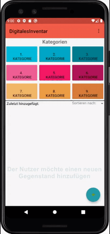

# Digitales Inventar

[Beschreiben Sie hier in einer kurzen Zusammenfassung Hintergrund, Ziele und Funktionen Ihrer Anwendung. Fügen Sie einen sinnvollen Screenshot ein. Geben Sie eine Link zur aktuellsten Veröffentlichung an.]

Technische Informationen zur dieser Anwendung finden sich [hier](./docs/Setup.md), eine detaillierte Übersicht über den Anforderungskontext findet sich [hier](./docs/Overview.md).

## Team

[Beschreiben Sie hier die einzelnen Teammitglieder mit Namen, E-Mail-Adresse, Github-Nutzer und Foto.]
Fabian Feldmeier, fabian.feldmeier@stud.uni-regensburg.de, FabianFeldmeier
Tanja Gehr, tanja.gehr@stud.uni-regensburg.de, tangeh
Lucas Haberl, lucas.haberl@stud.uni-regensburg.de, HaberlPre
Laura Zeilbeck, laura.zeilbeck@stud.uni-regensburg.de, LadyViolet

## Beschreibung

[Dokumentieren Sie alle aktuell implementierten Funktionen der Anwendung. Verwenden Sie Screenshots und ggf. auch Gif-Dateien um zentrale Elemente und Abläufe zu beschreiben.]

Die aktuelle Version des Digitalen Inventars erlaubt es dem Nutzer/in Gegenstände zu seinem/ihrem Inventar hinzuzufügen und diese wieder zu entfernen. Dabei kann ein Name für den Gegenstand vergeben werden. Der/die Nutzer/in kann seine/ihre Gegenstände nach dem Erstellungsdatum aufgelistet einsehen.

