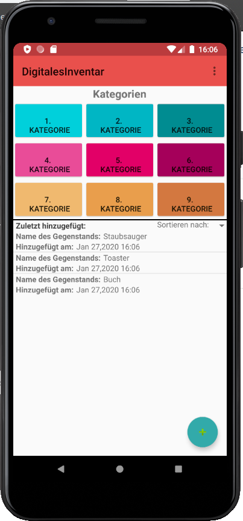

# Digitales Inventar

Das Digitale Inventar ist eine Anwendung, welche die Orgnanisation und Verwaltung eines Haushalts vereinfachen und übersichtlicher gestalten soll.
Mit Hilfe des Digitalen Inventars soll es möglich sein, jegliche Art Gegenstände zu erfassen, diese zu kategorisieren und besser verwalten zu können.\
Der/Die Nutzer/in kann seine/ihre Gegenstände erfassen, benennen und verschieden annotieren.
Der/Die Nutzer/in kann verschiedene Kategorien erstellen, benennen und verwalten.
Änderungen des Bestands können über Löschungen und Editierungen an den Gegenständen und Kategorien nachvollzogen werden.

[zweite Veröffentlichung](./docs/APK/DigitalesInventarV02.apk)\
[erste Veröffentlichung](./docs/APK/DigitalesInventarV01.apk)

Technische Informationen zur dieser Anwendung finden sich [hier](./docs/Setup.md), eine detaillierte Übersicht über den Anforderungskontext findet sich [hier](./docs/Overview.md).

## Team

#### Fabian Feldmeier
\
fabian.feldmeier@stud.uni-regensburg.de\
[FabianFeldmeier](https://github.com/FabianFeldmeier)

#### Lucas Haberl
\
lucas.haberl@stud.uni-regensburg.de\
[HaberlPre](https://github.com/HaberlPre)

#### Tanja Gehr
\
tanja.gehr@stud.uni-regensburg.de\
[tangeh](https://github.com/tangeh)

#### Laura Zeilbeck
\
laura.zeilbeck@stud.uni-regensburg.de\
[ladyViolet](https://github.com/ladyViolet)

## Beschreibung

Das Digitale Inventar erlaubt es zum derzeitigen Standpunkt dem Nutzer/in Gegenstände zu seinem/ihrem Inventar
hinzuzufügen und diese wieder zu entfernen.\
Eine individuelle Anmeldung ist durch eine Email-Adresse notwendig.
Dabei kann ein Name, ein Ort und eine Kategorie für den Gegenstand vergeben werden.\
Der/Die Nutzer/in kann seine/ihre Gegenstände nach dem Erstellen bearbeiten und Name, Ort und Kategorie ändern.
Der/Die Nutzer/in kann seine/ihre Gegenstände nach dem Erstellungsdatum aufgelistet einsehen.
Das Erstelldatum wird automatisch vom System hinzugefügt.\
Der/Die Nutzer/in kann einen oder mehrere Gegenstände aus dem System löschen.\
Der/Die Nutzer/in kann die Gegenstandsliste nach Name, Ort und Kategorie durchsuchen.\
Der/ Die Nutzer/in kann seine/ihre Gegenstände nach den Kategorien filtern lassen.

